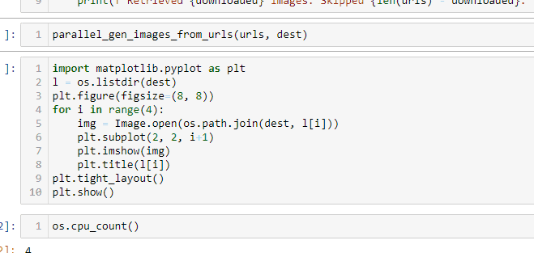
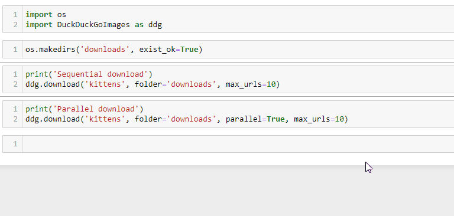

# Building image datasets with public images on the web

Note: Check the individual notebooks for the download instructions and flags.
All these methods can be run via a python script too.
## Method 1
[Using the HuggingFace image search API](https://github.com/Nachimak28/public_image_download_methods/blob/main/Downloading%20public%20images%20using%20huggingface%20image%20search%20API.ipynb)



## Method 2

With the help of DuckDuckGo

A prerequisite here is to install the DuckDuckGoImages (preferrably in a virtualenv or conda environment)

* Installing the original package

```sh
pip install DuckDuckGoImages
```

* Install my fork with a progress bar
```sh
# clone the repo
git clone git clone https://github.com/Nachimak28/DuckDuckGoImages

# change directory into the cloned repo folder
cd DuckDuckGoImages

# switch to branch progress-bar-display
git checkout git checkout progress-bar-display

# install the package
python setup.py install
```

[Using the DuckDuckGoImage package]()



## Method 3

Using the Fatkun Batch Downloader Image Chrome extension
[Fatkun Batch Downloader Image](https://chrome.google.com/webstore/detail/fatkun-batch-download-ima/nnjjahlikiabnchcpehcpkdeckfgnohf?hl=en)

Note: Be careful while installing chrome extensions. Review their Privacy practices

This is another options to download images using the extension but the Methods 1 and 2 are helpful when downloading images directly on a server.